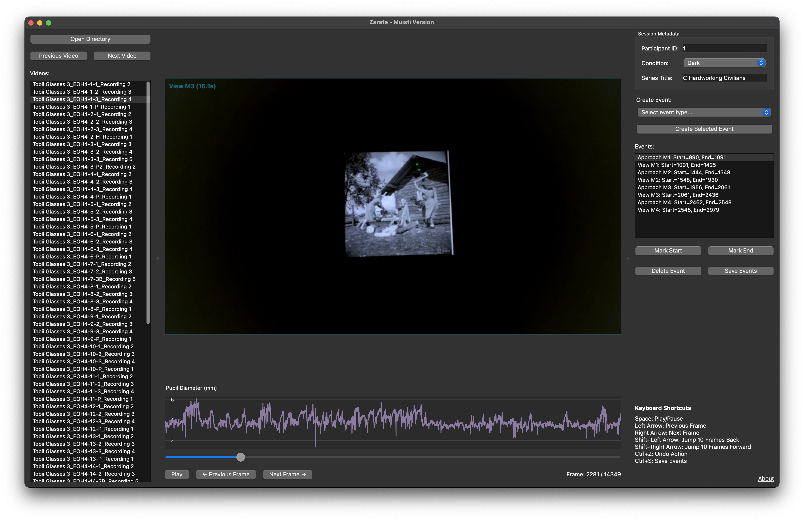

# Zarafe 

Zarafe is a video annotation tool designed for marking time events in eye tracking videos with gaze data visualization.

<p align="center">

</p>

## Overview

This tool allows users to:
- Load directories containing worldCamera.mp4 recordings and gazeData.tsv files
- View eye tracking videos with gaze position overlays
- Create, mark and manage time-based event annotations
- Save annotations to CSV files for further analysis

## Data Preparation

**Important**: Before using Zarafe, you need to convert your eye tracking data:

1. First convert your raw eye tracking data using [glassesTools](https://github.com/dcnieho/glassesTools/tree/master/src/glassesTools)
2. This will generate the required worldCamera.mp4 and gazeData.tsv files

Zarafe expects a specific directory structure with each recording in its own folder containing both files.

## Installation

1. Clone this repository:
   ```
   git clone https://github.com/mh-salari/zarafe.git
   cd zarafe
   ```

2. Install dependencies:
   ```
   pip install -r requirements.txt
   ```

3. Run the application:
   ```
   python main.py
   ```

## Notes

Zarafe was developed by Mohammadhossein Salari with assistance from Claude 3.7 Sonnet, an AI assistant developed by Anthropic. Please be aware that this software is primarily for internal purposes and is not thoroughly documented. 


## License

This project is licensed under the MIT License - see the [LICENSE](LICENSE) file for details.

## Acknowledgments

This project has received funding from the European Union's Horizon Europe research and innovation funding program under grant agreement No 101072410, Eyes4ICU project.

<p align="center">

</p>

Giraffe icon downloaded from <a href="https://www.flaticon.com/free-icons/giraffe" title="giraffe icons">Giraffe icons created by Freepik - Flaticon</a>